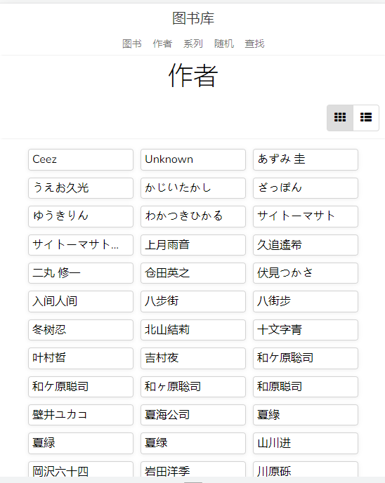
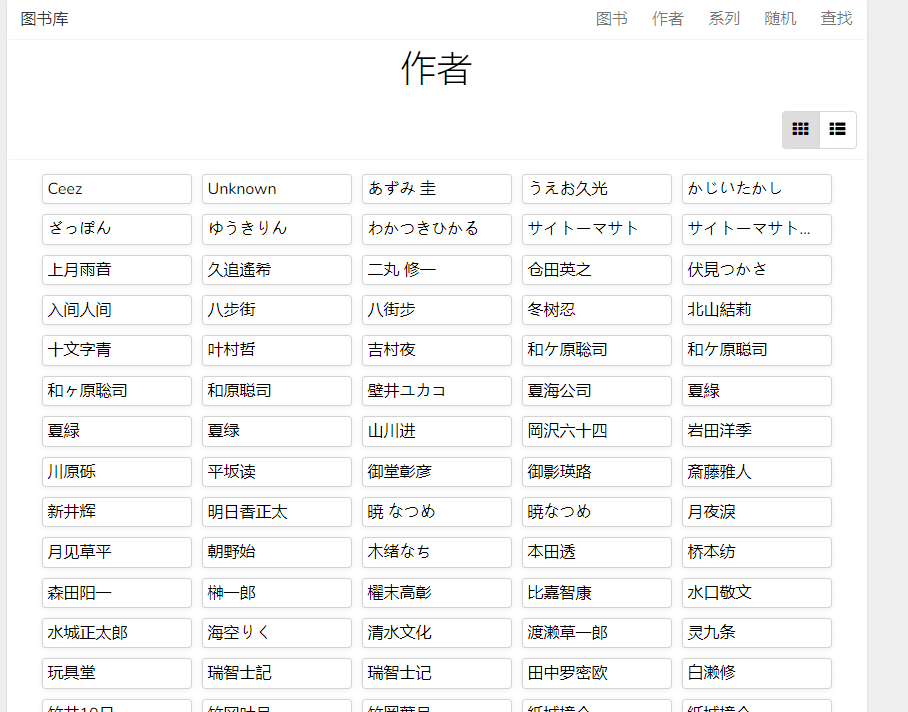
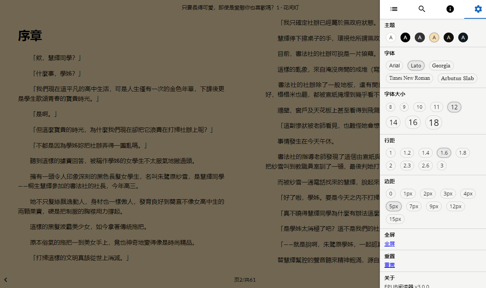

# 图书库

这是nas端图书管理器BookBrowser的汉化版

一个易于使用的工具，用于生成基于 Web 的 ePub 和 PDF 电子书浏览器。您需要做的就是将其下载到您的电子书所在的文件夹中，然后运行它。还有一个演示。

# 特征
多种书籍格式

电子版

pdf

mobi（基本支持）

搜索

高级搜索

搜索任意字段组合

查看结果中的所有信息

列表显示

响应式网页界面

更新通知

浏览方式：

作者

系列

排序：

最后添加

按字母顺序

基于网络的阅读器

自定义字体、颜色、大小、间距

记住你的阅读位置

图书搜索

使用方便快速

没有额外的依赖

## 截图

|  |  |  |  |
| --- | --- | --- | --- |
|  |  |  |  |

## 阅读器截图

| 桌面 | 移动 |
| --- | --- |
|  |  |

## 高级搜索

|  |
| --- |
| |

## 系统要求
服务器适用于所有平台。

Web 界面适用于 IE 9+、Edge、Firefox 3+、Chrome、Safari 5.1+、Opera 17+ 和 Android 浏览器 4.4+。

基于网络的阅读器适用于 IE 10+、Edge、Firefox 28+、Chrome 21+、Safari 9+、Opera 17+ 和 Android 浏览器 4.4+。

## 用法

```
Usage: BookBrowser [OPTIONS]

Options:
  -a, --addr string      the address to bind the server to ([IP]:PORT) (default ":8090")
  -b, --bookdir string   the directory to load books from (must exist) (default "/home/patrick/src/BookBrowser")
  -h, --help             Show this help text
  -n, --nocovers         do not index covers
  -t, --tempdir string   the directory to store temp files such as cover thumbnails (created on start, deleted on exit unless already exists) (default "/tmp/bookbrowser946254949")
      --version          Show the version
```
